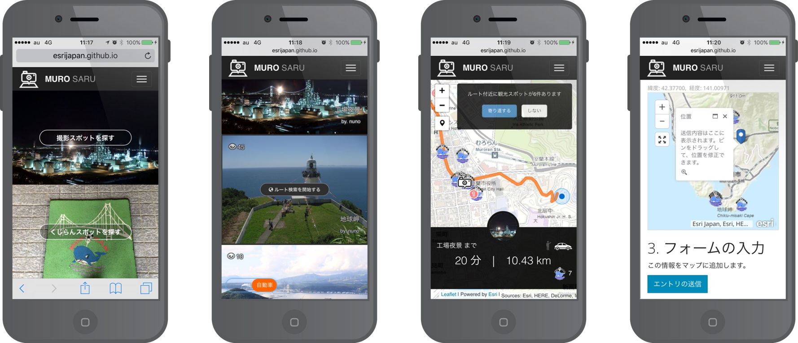

# [Photospot Finder (MUROSARU)](https://esrijapan.github.io/photospot-finder/?demo)

室蘭市の2016年11月14日に開催された[企業・団体対抗 観光ハッカソン](https://ja.localwiki.org/mr/%E4%BC%81%E6%A5%AD%E3%83%BB%E5%9B%A3%E4%BD%93%E5%AF%BE%E6%8A%97%E3%83%8F%E3%83%83%E3%82%AB%E3%82%BD%E3%83%B3)向けに作成したアプリです。

MUROSARU (ムロサル) とは、北海道の方言にある「書かさる」、「押ささる」などの「〜さる」といった意思に反して行われるというニュアンスの言葉からもじった造語です。このアプリのコンセプトは「寄り道」なので、目的地でないにも関わらず、つい引き寄せられてしまうという意味合いを込めています。

近くにある観光名所を望むのに適した撮影スポットを写真で視覚的に伝え、そこまでのルートを案内します。また、市内に点在する室蘭市マスコットである[「くじらん」](http://www.city.muroran.lg.jp/main/org2200/kujiran.html)の場所を共有して、みんなで隠れくじらんを探したり、投稿したりすることができます。



## 機能一覧

アプリの機能仕様一覧です。

- 写真一覧から選択した写真が撮影されたスポットまでのルート案内をします。
- 写真一覧はユーザーの現在位置から一定範囲内に含まれる撮影スポットの写真のみをリストし、画面左下のスイッチでトラベルモード (徒歩 | 自動車) を切り替えると、範囲半径が移動モードによって変化します。
- 移動モードに応じたルート結果を表示します。ルート結果は地図に描画されるルート線と時間・距離です。
- ルート案内後に、ルート線から一定距離内にある観光スポットを自動検索し、寄り道ルートの提案を行います。
- ルート案内後に、ルート線から一定距離内にあるくじらん (市内に点在する室蘭市マスコット) を自動検索し、くじらんの数を表示します。
- 最近検索したルートは端末 (ブラウザーの LocalStorage) に自動保存され、次回起動時に参照することができます。
- 撮影スポット、くじらんスポットの投稿フォームから写真の投稿が行えます。
- レスポンシブな Web アプリなので各種端末のブラウザーで閲覧可能ですが、デザインはモバイルに最適化しています。

[MUROSARU デモ](https://esrijapan.github.io/photospot-finder/?demo) では、ルート検索の利用に [ArcGIS for Developers](https://developers.arcgis.com/) の[アカウント (無償)](http://esrijapan.github.io/arcgis-dev-resources/get-dev-account/) が必要です。ルート案内は最大で 1,250 回/月まで可能です。観光スポットの寄り道ルートを毎回含めることを想定した場合は最大で 92 回/月になるのでご注意ください。

デモアプリは現在位置を室蘭市某所に固定しています。実際の現在位置でアプリを利用したい場合は以下のリンクよりアクセスください。

- [MUROSARU](https://esrijapan.github.io/photospot-finder/)


## インストール

開発者向けの使用方法です。

自身のアカウントに Fork およびクローン後、以下の操作によってアプリをビルドします。

1. 以下のコマンドを実行して npm 依存モジュール (ビルドに必要なモジュール) をインストールします。
> ```
> npm install
> ```

1. 以下のコマンドを実行してアプリをビルドします。`src` フォルダー内のソース ファイルを参照して `dist` フォルダーにビルドしたファイルを作成します。
> ```
> npm run build
> ```

1. 以下のコマンドを実行してビルドしたアプリの起動確認をします。ビルド ファイルをもとに最小化されたアプリ ファイルが `docs` フォルダー内に作成されます。ファイル作成後、自動的に簡易 Web サーバーが起動します。
> ```
> npm run start
> ```

1. `docs` フォルダー内のファイルが最終的なアプリの構成ファイルになるので、ご自身の Web サーバーにホストしてください。


## アプリの設定

アプリの設定方法です。

`src/app/config.js` の `appConfig` オブジェクトにアプリの設定項目が含まれています。これを更新することによって、アプリが参照するデータや UI を更新することができます。

Photospot Finder は ArcGIS の Web サービスを参照することによって動作します。設定項目にあるデータ参照先 (`endpointUrl`) は ArcGIS REST エンドポイントを設定します。

参照するサービスは以下のとおりです。

- ルート案内サービス ([REST エンドポイントについて](http://resources.arcgis.com/en/help/arcgis-rest-api/#/Route_service_with_synchronous_execution/02r300000036000000/))
- 自身でホストした撮影スポット
- 自身でホストした街の隠れ◯◯スポット
- 自身でホストした観光スポット
- Web マップ (ArcGIS のクラウド上で作成・管理・共有できる Web 地図)

上記のサービスは自由に変更が可能です。
お好きな地域の観光スポット データを ArcGIS にホスティングして、アプリに設定することで、その地域向けの観光アプリに組み替えることができます。
また、ルート案内サービスの利用にはユーザー (あるいは開発者) ごとに上限が設定されているため、利用にはトークンが必要となります。

これら ArcGIS のサービスのセットアップについては以下のドキュメントを参照ください。

- [ルート案内利用時に必要なセットアップ (認証) について](http://esrijapan.github.io/arcgis-dev-resources/proxy-services/)
- [データのホスティングについて](http://esrijapan.github.io/arcgis-dev-resources/create-feature-service/)
- [Web マップの作成について](http://esrijapan.github.io/arcgis-dev-resources/create-webmap/)


## ライセンス

Copyright 2016 Esri Japan Corporation.

Apache License Version 2.0（「本ライセンス」）に基づいてライセンスされます。あなたがこのファイルを使用するためには、本ライセンスに従わなければなりません。本ライセンスのコピーは下記の場所から入手できます。

> http://www.apache.org/licenses/LICENSE-2.0

適用される法律または書面での同意によって命じられない限り、本ライセンスに基づいて頒布されるソフトウェアは、明示黙示を問わず、いかなる保証も条件もなしに「現状のまま」頒布されます。本ライセンスでの権利と制限を規定した文言については、本ライセンスを参照してください。

ライセンスのコピーは本リポジトリの[ライセンス ファイル](./LICENSE)で利用可能です。
